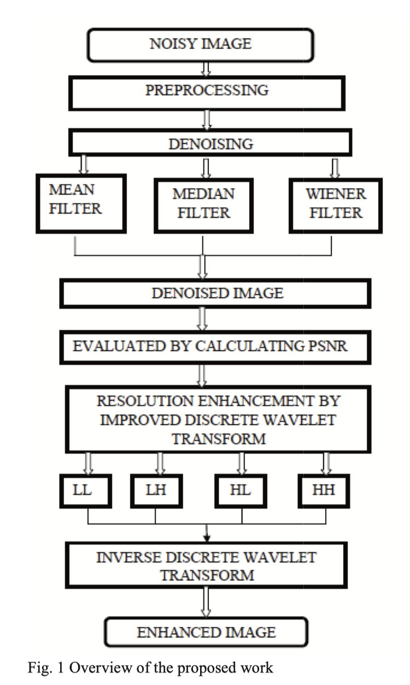

# Multiple Sclerosis Detection

* **Objective evaluation of multiple sclerosis lesion segmentation using a data management and processing infrastructure** ([PDF](Objective evaluation of multiple sclerosis lesion segmentation using a data management and processing infrastructure..pdf)) ([online](https://www.nature.com/articles/s41598-018-31911-7))

  - Evaluation Criteria
    + Segmentation Evaluation:  precision of contours e.g. average 					surface distance and Dice overlaps

    + Detection Evaluation: lension detected independently of 						precise delineation e.g. F1
  - Unknown scanner leads to worse performance

  - Combined methods beat individual algorithms using LOP STAPLE algorithm

* **Longitudinal multiple sclerosis lesion segmentation data resource ** （[PDF](Longitudinal multiple sclerosis lesion segmentation data resource.pdf))([online](https://www.sciencedirect.com/science/article/abs/pii/S1053811916307819))

  + Dataset description for this challenge: http://smart-stats-tools.org/lesion-challenge-2015

  

* **Efficient quality analysis of MRI image using preprocessing techniques**   ([PDF](Efficient_quality_analysis_of_MRI_image_using_preprocessing_techniques.pdf))

  + Medical image processing pipeline: denoising using Gaussain, average and Wiener filter and resolution enhancement with Discrete Wavelet Transform

  

* **FuNP (fusion of neuroimaging preprocessing) pipelines: a fully automated preprocessing software for functional magnetic resonance imaging** ([online](https://www.ncbi.nlm.nih.gov/pmc/articles/PMC6378808/))

* **Multiple Sclerosis Lesion Segmentation using Improved Convolutional Neural Networks** ([PDF](Multiple Sclerosis Lesion Segmentation using Improved Convolutional Neural Networks.pdf))

* **Generative Adversarial Nets** ([PDF](GAN.pdf))

  - Two parts: a generator and a discriminator, which play following two-player minimax game with value function V (G, D):

    

* Automatic Diagnosis of COVID-19 from CT Images using CycleGAN and Transfer Learning.

  ([PDF](Chapter-MedicalImageGenerationusingGAN.pdf))

* A Review on Generative Adversarial Networks: Algorithms, Theory, and Applications ([PDF](A Review on Generative Adversarial Networks.pdf))

